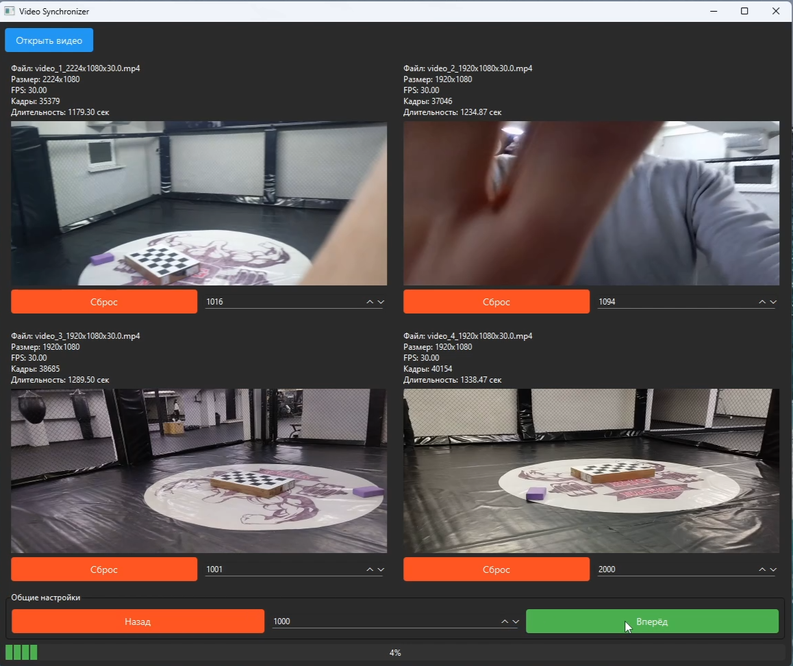

# Video Synchronizer

## Описание
**Video Synchronizer** — это программа для синхронизации нескольких видеофайлов. Она позволяет просматривать несколько видеороликов одновременно, перемещаться между кадрами и управлять их воспроизведением.

## Функционал
- **Открытие нескольких видеофайлов**: Вы можете загрузить до 4 видеофайлов для одновременного просмотра.
- **Синхронизация кадров**: Перемещайтесь между кадрами всех видео одновременно с помощью кнопок "Назад" и "Вперёд".
- **Настройка интервала**: Укажите количество кадров, на которое будет происходить переход при нажатии кнопок.
- **Индикатор прогресса**: Отслеживайте текущий прогресс воспроизведения видео.
- **Кэширование кадров**: Для повышения производительности программа кэширует уже загруженные кадры.

## Скриншоты

  
*Пример работы программы.*


## Требования
Для запуска программы необходимы следующие зависимости:
- Python 3.8 или выше
- Библиотеки:
  - PySide6
  - OpenCV (cv2)

## Установка

1. Клонируйте репозиторий:
   ```bash
   git clone https://github.com/Prikur76/video-synchronizer.git
   ```

2. Установите зависимости:
   ```bash
   pip install pyside6 opencv-python
   ```

3. Запустите программу:
   ```bash
   python app.py
   ```

## Использование

1. После запуска программы нажмите кнопку **"Открыть видео"** в верхней части окна.
2. Выберите один или несколько видеофайлов (максимум 4).
3. Используйте кнопки **"Назад"** и **"Вперёд"**, чтобы перемещаться между кадрами.
4. Настройте интервал перемещения с помощью поля ввода между кнопками.

## Настройки интерфейса
- **Кнопка "Открыть видео"**: Нажмите, чтобы выбрать видеофайлы для загрузки.
- **Поле интервала**: Укажите количество кадров, на которое будет происходить переход.
- **Кнопка "Назад"**: Переместиться назад на указанное количество кадров.
- **Кнопка "Вперёд"**: Переместиться вперёд на указанное количество кадров.
- **Индикатор прогресса**: Показывает текущий прогресс воспроизведения видео.

## Технические детали

### Архитектура
Проект состоит из следующих модулей:
- **`app.py`**: Главный файл приложения, содержащий точку входа.
- **`video_panel.py`**: Модуль для работы с отдельными видео панелями.
- **`main_window.py`**: Модуль для создания главного окна приложения.

### Кэширование
Программа использует внутренний кэш для хранения уже загруженных кадров, что ускоряет их повторную загрузку.

### Асинхронная загрузка
Для предотвращения блокировки интерфейса при переключении кадров используется многопоточность (`QThread`).

## Авторы
- **Vladimir Shisterov** - [Prikur76](https://github.com/Prikur76)

## Лицензия
Этот проект распространяется под лицензией MIT. Подробнее см. файл [LICENSE](LICENSE).

---

Спасибо, что используете **Video Synchronizer**!